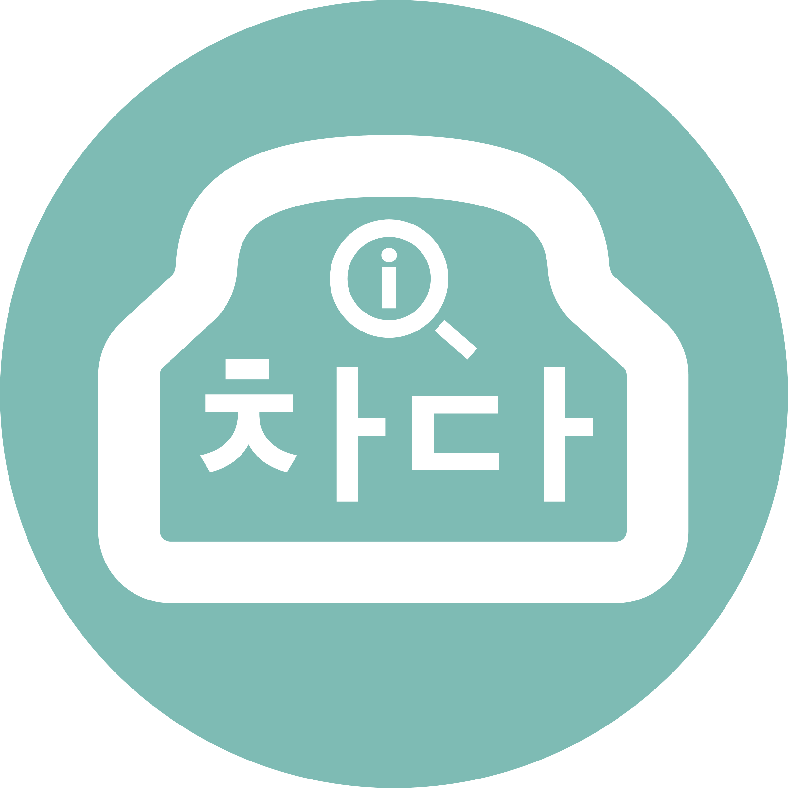

<!-- PROJECT LOGO -->
 

  

  <h3 align="center">Automobile Diagnostic Application /w OBD</h3>

  

    Project from 1ot of 42Seoul
     
     
    
    
     
    
    

  

 

## what is Chada
---
'차다'는 eml327모듈을 이용해, 차량의 OBD단자에 접속해 차량의 상태를 진단 및 모니터링 할 수 있는 앱입니다.

 

## Brochure
---
[Korean ( Link to Google Drive )](https://docs.google.com/document/d/1c8JLn1_GbQ3_nuu-5PcHmePW4V42cGiv/edit?usp=sharing&ouid=113150361165067684964&rtpof=true&sd=true)

 

## Demo
---

[ youTube Link below ]

 

## Member

| [JaeHwan Kim](https://github.com/jae-hwan-kim) | [Jihoon Kim](https://github.com/komskoms) | [SeungEun Oh](https://github.com/tmddms927) |
| --- | --- | --- |
|  |  |  |

 
 

<!-- LICENSE -->
## License

해당 프로젝트는 [MIT 라이센스](https://github.com/42-Tomodachi/ft_transcendence/blob/main/LICENSE)를 기반으로 두고 있습니다.

<a href="#readme-top">back to top</a>

